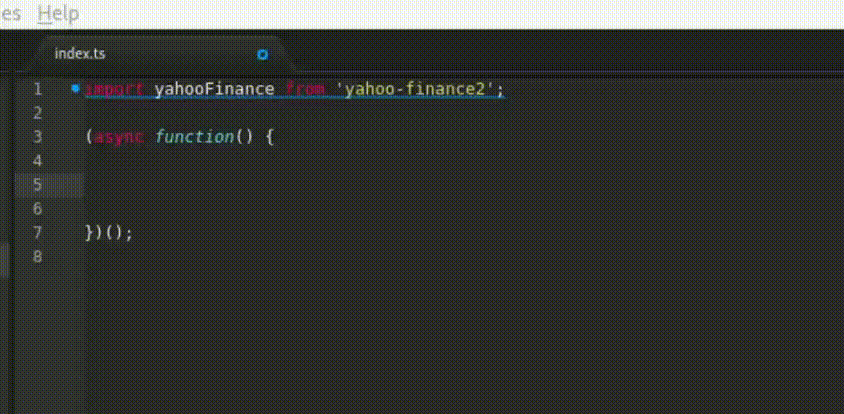

# node-yahoo-finance2

Community API for Yahoo-Finance.

Copyright (c) 2021 by Gadi Cohen and Pilwon Huh.  [MIT licensed](./LICENSE).

[](https://www.npmjs.com/package/yahoo-finance2) [](https://circleci.com/gh/gadicc/node-yahoo-finance2) [](https://codecov.io/gh/gadicc/node-yahoo-finance2) [](https://github.com/semantic-release/semantic-release) [](http://www.typescriptlang.org/) [](./LICENSE)

Supports Node 18.20.4 and up (tests are run against 18.20.4),
e.g. all active LTS versions.

**Stable release** - supersedes the ubiquitous
[node-yahoo-finance](https://www.npmjs.com/package/yahoo-finance)
v1. NB: The API has changed, see [UPGRADING](./docs/UPGRADING.md)
for more information.

[Live Demo on CodeSandbox](https://codesandbox.io/p/devbox/yahoo-finance2-nextjs-sy42pv)
(Updated 2024-06-17; NextJS with both RSC and Hook-Relay examples)

## Unofficial API

This project is neither created nor endorsed by Yahoo Inc.  Yahoo does not
provide any official API to developers, nor makes any guarantees regarding
service availability or API consistency.  In practice however, the open
source community has kept this project (and it's predecessor) working well
since 2013.

Nevertheless, we make no guarantees and you use this package at your own risk.
The developers (and obviously Yahoo) cannot be held responsible for any losses
you may incur as a result of using this service.  Use of this package is
considered acknowledgement and acceptance of these terms and of its license.

## Quickstart

**CLI** (Command line interface)

```bash
$ npx yahoo-finance2 --help
$ npx yahoo-finance2 search AAPL
$ npx yahoo-finance2 quoteSummary AAPL
$ npx yahoo-finance2 quoteSummary AAPL '{"modules":["assetProfile", "secFilings"]}'

# or install it
$ npm install -g yahoo-finance2
$ yahoo-finance search AAPL '{ "someOption": true }'
```

**Importing**

```js
// import syntax (recommended)
import yahooFinance from 'yahoo-finance2';

// require syntax (if your code base does not support imports)
const yahooFinance = require('yahoo-finance2').default; // NOTE the .default

const results = await yahooFinance.search('AAPL');
const results = await yahooFinance.search('AAPL', { someOption: true, etc });
```

Available modules:
~[`autoc`](./docs/modules/autoc.md)~,
[`chart`](./docs/modules/chart.md),
[`historical`](./docs/modules/historical.md),
[`quote`](./docs/modules/quote.md),
[`quoteSummary`](./docs/modules/quoteSummary.md) (submodules:
assetProfile, balanceSheetHistory, balanceSheetHistoryQuarterly,
calendarEvents, cashflowStatementHistory, cashflowStatementHistoryQuarterly,
defaultKeyStatistics, earnings, earningsHistory, earningsTrend, financialData,
fundOwnership, fundPerformance, fundProfile, incomeStatementHistory,
incomeStatementHistoryQuarterly, indexTrend, industryTrend, insiderHolders,
insiderTransactions, institutionOwnership, majorDirectHolders,
majorHoldersBreakdown, netSharePurchaseActivity, price, quoteType,
recommendationTrend, secFilings, sectorTrend, summaryDetail, summaryProfile,
symbol, topHoldings, upgradeDowngradeHistory),
[`search`](./docs/modules/search.md),
[`recommendationsBySymbol`](./docs/modules/recommendationsBySymbol.md),
[`trendingSymbols`](./docs/modules/trendingSymbols.md),
[`options`](./docs/modules/options.md),
[`insights`](./docs/modules/insights.md), 
[`dailyGainers`](./docs/modules/dailyGainers.md), with more
[coming soon](https://github.com/gadicc/node-yahoo-finance2/issues/8).

Extras: [`quoteCombine`](./docs/other/quoteCombine.md).
Utils: [`setGlobalConfig`](./docs/other/setGlobalConfig.md).

See the [Full Documentation](./docs/README.md).

Particularly, make sure to read the notes there on
[ERROR HANDLING](./docs/README.md#error-handling).
Be aware that if a stock gets delisted, Yahoo removes all related
data, including historical (and chart) data from periods *before* the
delisting occurred (i.e. queries that worked before will start failing,
and there is no way to retrieve this data again).

## Even Quicker Start - Stock Price

```js
const quote = await yahooFinance.quote('AAPL');
const { regularMarketPrice as price, currency } = quote;
```

## NB: CommonJS / ES modules

This package is shipped as **both an ES Module and a CommonJS module**.  Node will
*automatically* load the ES module if:

* *Your* `package.json` contains a `{ type: module }` entry
* You're running at least Node 12 (maybe with `--experimental-module` flag).
* You `import` the module (`require` function does not exist in ES modules)

otherwise the traditional CommonJS module will be loaded.  No flags are
necessary for Node 12.7.0+ and Node 13.2.0+, but for older versions, you need
to add the `--experimental-module` flag).

ES Modules are "relatively" new.  They got a big boost in April 2021 when
Node 10, which did not support them, reached end-of-life.  However, support
varies by build tool and configuration, and there are some edge cases which
can be tricky.  Please open an issue if you run into any trouble.

**require (CommonJS)**

If you use load the library with `require`, make sure to add `.default`:

```js
const yahooFinance = require('yahoo-finance2').default; // NOTE the .default
```

## (Optional) TypeScript Love

Working with `yahoo-finance2` is a joy if you're using TypeScript (but you
don't have to), with type checking and auto completion:



Try it yourself on our
[Live CodeSandbox](https://codesandbox.io/s/yahoo-finance2-312x2?file=/src/index.ts).

## Using in the Browser (TL;DR; possible but unsupported)

This project is primarily developed to be used server-side in `node`.
Nevertheless, due to the large number on requests on this issue, we have
taken care to ensure the package can be imported in the browser too.

HOWEVER: you'll run into other challenges there that we can't help you with,
particularly CORS issues when trying to query Yahoo's servers in the browser
from non-Yahoo origins.  Since Yahoo is specifically blocking such requests,
we will not help you bypass them.  (One way around this is to run your own
server to proxy your requests, but we won't help you with this).

## Contributing

Pull Requests welcome!  Read [CONTRIBUTING.md](./CONTRIBUTING.md) and join
our list of heroes:


Special mention goes out to [pudgereyem](https://github.com/pudgereyem) and
[PythonCreator27](https://github.com/PythonCreator27) who made significant
contributions in the very early days of this project.

## Credits

* Massive thanks to [@pilwon](https://github.com/pilwon) for the original
[node-yahoo-finance](https://www.npmjs.com/package/yahoo-finance)
and for all our prior collaborations on this and other projects 🙏
